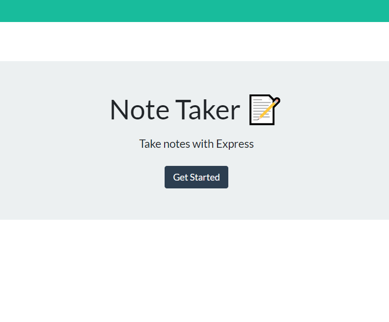

# Notetaker

## Table of Contents

1.[Description](#Description)  
2.[Link](#Link)  
3.[Installation](#Installation)  
4.[Usage](#Usage)  
5.[License](#License)  
6.[Questions](#Contacts)

## Link to repo

Repo: https://github.com/mkang987/Notetaker

Live link: https://ancient-tundra-70151.herokuapp.com/

## Description

Simple app that uses Express, JS and HTML to create a notebook that lets you create new notes and have them saved. If they are not needed anymore, you can delete the notes. The application is deployed live using Heroku.

## Licenses

  
[License Information](./generatedLicense.md)

## Installation

None, launch app using the live link from Heroku:

https://ancient-tundra-70151.herokuapp.com/

## Usage

From the landing page press the "Get Started" button.

On the left you will see any saved notes. Press the "+" button on the top right corner to start creating a new note. Add a title and the contents of your notes. Once you have filled it out, you can press the "Save" button provided. Any unwanted notes can be deleted.

## Contacts

Contact me via Email at mkang987@gmail.com
